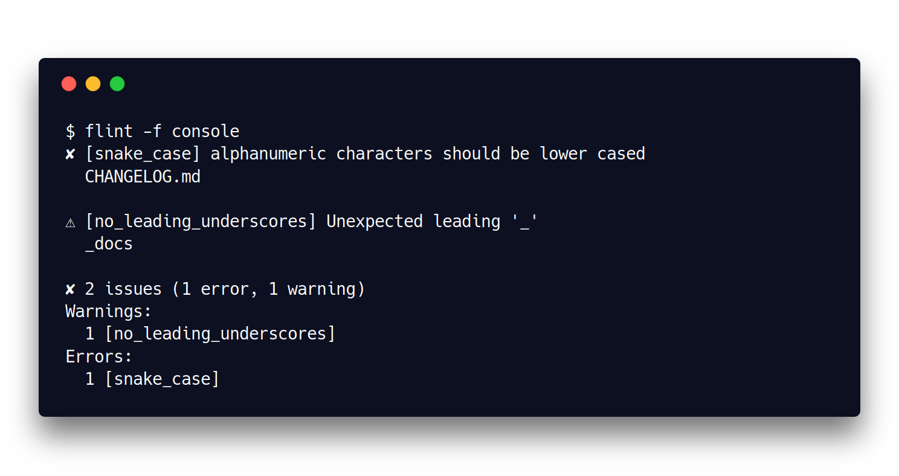
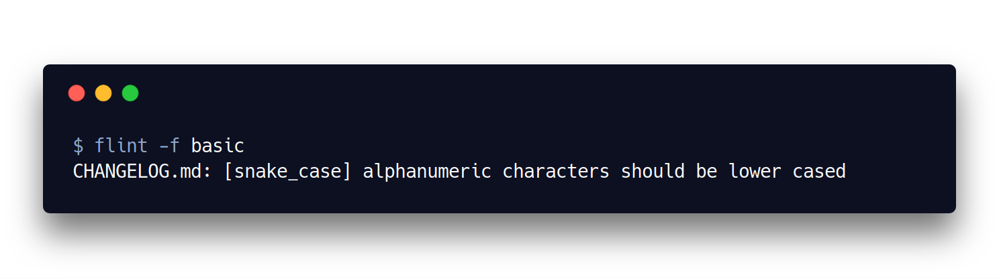
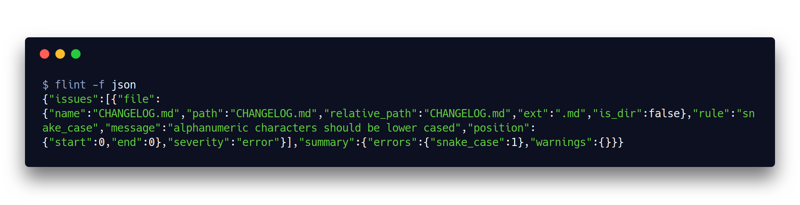
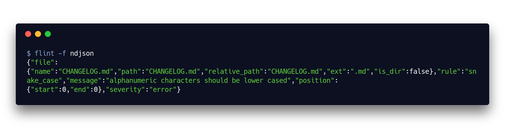

<p align="center">
  <h3 align="center">flint</h3>
  <p align="center">The filesystem linter</p>
</p>

--------

[](https://travis-ci.org/bloom42/flint)
[](https://github.com/bloom42/flint/releases)
[](https://crates.io/crates/flint)
[](https://docs.rs/flint)


You think there is no place in code reviews to discuss about files naming conventions ?
Enforce consistent files and directories naming rules with **flint**: the filesystem linter.

1. [Documentation](#documentation)
2. [Docker image](#docker-image)
3. [Contributing](#contributing)
4. [Licensing](#licensing)
5. [Sponsoring](#sponsoring)
6. [Security](#security)

--------


## Documentation

See the [Wiki](https://gitlab.com/bloom42/flint/wikis)


## Docker image

[registry.gitlab.com/bloom42/flint](https://gitlab.com/bloom42/flint/container_registry)


## Contributing

Thank you for your interest in contributing! Please refer to
[https://bloom.sh/contribute](https://bloom.sh/contribute) for guidance.


## Licensing

See `LICENSE.txt` and [https://bloom.sh/licensing](https://bloom.sh/licensing)


## Sponsoring

Bloom is a free and open source project. If you are interested in supporting this project, the core team
and the contributors please visit our
[sponsoring page](https://bloom.sh/become-a-sponsor) ✌️


## Security

If you found a security issue affecting this project, please do not open a public issue and refer to our
[dedicated security page](https://bloom.sh/security) instead. Tahnk you.
<!--
## Installation

### Using Rust
```sh
$ cargo install flint
```


## Docker image

[quay.io/bloom42/flint](https://quay.io/bloom42/flint)

```sh
$ docker run -v `pwd`:/flint quay.io/bloom42/flint:latest
```


## Usage

Configuration is stored in a `.flint.sane` (see [here for more info about the SANE configuration format](https://gitlab.com/bloom42/sane))
file at the root of your project (repo).

When ran, flint will recursively search upward for a configuraiton file, starting in the current
directory.

```bash
$ cat .flint.sane
```
```sane
rules = [
  {
    pattern = "*.rs", # optional, default to "*"
    convention = "snake_case", # mandatory, one the default conventions below or a Rust regex https://docs.rs/regex/1.1.4/regex/
  },
  {
    pattern = "*.go",
    convention = "^[a-z][a-z_\\d]*[a-z\\d]$",
  },
]
```


## Default conventions

| Name                  | Description                                                              |
| --------------------- | :----------------------------------------------------------------------- |
| `any`                 | Allow any filename `.*`                                                  |
| `snake_case`          | Force names to respect the `snake_case` convention `^[a-z][a-z_\d]*[a-z\d]$` |
| `kebab_case`          | Force names to respect the `kebab-case` convention `^[a-z][a-z\-\d]*[a-z\d]$` |
| `upper_snake_case`    | Force names to respect the `UPPER_SNAKE_CASE` convention `^[A-Z][A-Z_\d]*$` |
| `camel_case`    | Force names to respect the `camelCase` convention `^[a-z][A-Za-z\d]*$` |
| `pascal_case`    | Force names to respect the `PascalCase` convention `^[A-Z][A-Za-z\d]*$` |


<!-- ## Available formatters


### Console



### Basic



### Json



### Ndjson

 -->
