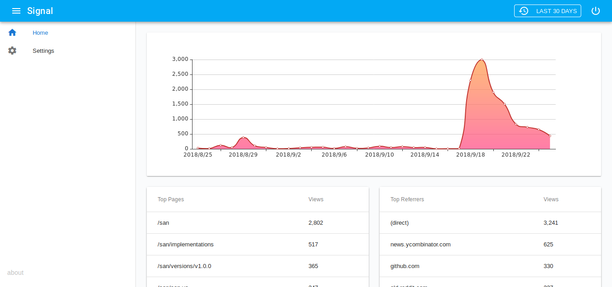

  
  <h2 align="center">Signal</h2>
  
Simple and beautiful Analytics

---

Signal lets you automatically capture every user interaction: clicks, submits, transactions, emails, and much more. You can then analyze it all retroactively. Liberate your analytics data!

1. [Repo organization](#repo-organization)
2. [Documentation](#documentation)
3. [License](#license)

---

## Repo organization

This repository is splitted into the following components:

| Directory |  Description | Documentation |
| --------- | ------------ | ------------- |
| [api](api) | Signal's API which receive events and process requests | [docs](https://opensource.bloom.sh/signal/api) |
| [docs](docs) | Contains all the documentation for the Signal platform | [docs](https://opensource.bloom.sh/signal) |
| [web](web) | Signal's web tracking library | [docs](https://opensource.bloom.sh/signal/web) |
| [www](www) | Signal's dashboard | [docs](https://opensource.bloom.sh/signal/www) |

## Documentation

See [https://opensource.bloom.sh/signal](https://opensource.bloom.sh/signal)

## License

See `LICENSE.txt` and [https://opensource.bloom.sh/licensing](https://opensource.bloom.sh/licensing)
